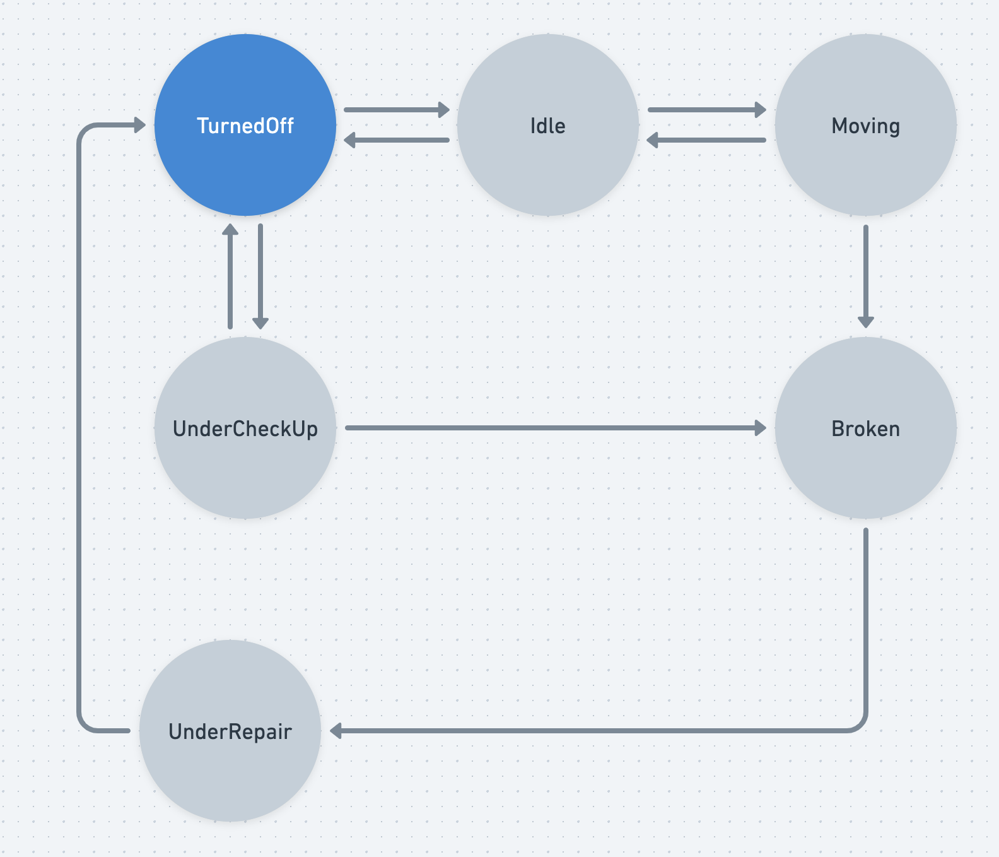

# Домашнее задание 4: Конечный автомат трамвая

## Схема автомата

В отличие от примера в уроке, я решил подойти к вопросу с точки зрения обслуживания и описал следующие состояния и переходы между ними




# Примеры использования

Чтобы создать процесс, необходимо вызвать `Hw4.start_link()`
После этого можно вызывать функции из списка ниже, чтобы инициировать переходы между состояниями


```elixir
  Hw4.start_link()
  # {:ok, pid}

  HW4.get_state
  # :turned_off

  HW4.make_idle
  # :idle

  HW4.make_under_check_up
  # raise ArgumentError, "transition from :under_check_up to :idle is not allowed"

  HW4.make_moving
  # :moving
  HW4.make_idle
  # :idle
  HW4.make_under_check_up
  # :under_check_up
  HW4.make_broken
  # :broken
  HW4.make_under_repair
  # :under_repair
  HW4.make_turned_off
  # :turned_off
```

Чтобы узнать текущее состояние трамвая- необходимо вызвать

```elixir
  HW4.get_state
  # :turned_off
```